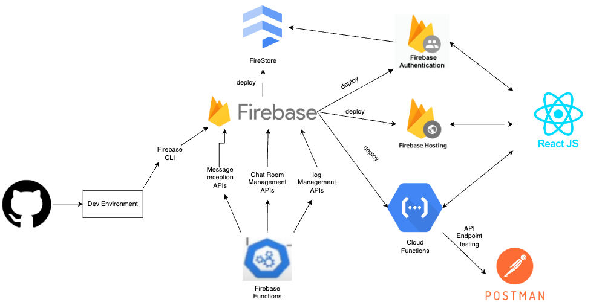
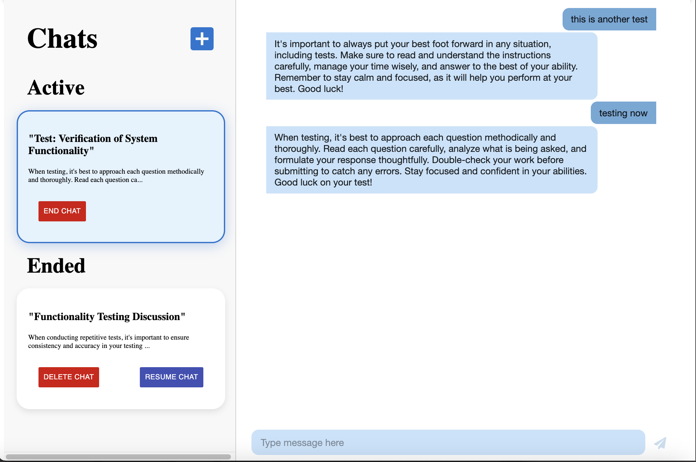

# RexAI-Career-Advisor

## Description
RexAI Career Advisor is a personal AI chatbot application that provides users with private and secure career advice. It leverages on the power of AI to deliver engaging and satisfying interactions, helping users navigate their career paths with confidence and clarity.

## Getting Started

These instructions will get you a copy of the project up and running on your own personal SAAS AI chatbot website.

### Prerequisites

- Node.js and npm
- Firebase CLI
- Firebase Functions
- Firebase Firestore Database
- Firebase Hosting
- Firebase Authentication
- Postman
- React
- Material UI
- Open AI

### Installation Process for Backend

1. First install Node.js and npm onto your computer
    - Use this link to install Node.js and npm: https://nodejs.org/en/download/package-manager
2. Go to the Firebase console, create/sign-in to an account, and create a project through the console by first naming the project.
3. Once the project is created, go to the project's settings and navigate to your apps. Select the web option, register a name to the app, enable Firebase Hosting for the app, click on 'register app', then click on 'continue' to navigate through the rest of the steps stated (these steps will be explained later on)
4. Configure your Firebase project's Cloud FireStore database by clicking the "create database" button within Firestore, set the name and location as default, click next, and then secure the rules by starting the data structure in test mode, then click create.
5. To gain access creating Cloud Functions on your Firebase project, upgrade your project's plan to the Blaze (pay-as-you-go) option, then click continue, then set a billing budget as you see fit, then click create.
6. Open up a new terminal and begin with cloning the whole repository: `git clone <repository-url>`
7. Navigate into the root of the functions directory: `cd functions`
8. Install dependencies: `npm install`. Now your ready to Setup the frontend.

### Installing for FrontEnd

1. Make sure that the backend of your project is running first before you move on to the next steps here
2. Go to the OpenAI website, create an account, and get access to a project API Key (you will also need to add credit into your account to be able to use OpenAI).
3. Navigate into the frontend directory: `cd ../frontend`.
4. Go to the .env file and put in your API key there as so by replacing the 'XXXXXX' with your OpenAI key.
5. Now go to your firebase project that you made within the firebase console, navigate to your project settings, scroll down and create a new web app there.
6. Add a nickname to the app, also, check off the option to set up Firebase hosting for this app.
7. Click next for the next two steps and then click on continue to console.
8. Now copy over the const variable that has your web app's Firebase configuration add replace to current one within the `src/api/firebase.js` file.
9. Go back to your Firebase project through the Firebase Console, and go to the authentication section. Configure your sign-in method as email/password by clicking on it as a native provider. Then Click enable for email/password only (not through email link) and then click save.
10. Type in `npm install` to install all of the dependencies within this project
11. Then run `npm start`, to make sure thatt your frontend is running at expected.
12. Then run `npm run build`, to get the final build of the frontend project. From here your ready to deploy everything to Firebase.

## Deployment To Firebase

1. Go back to the root of this project's repository.
2. Then install the Firebase CLI tools by using the command: `npm install -g firebase-tools`
3. Log in to Firebase CLI: `firebase login`
4. Initialize Firebase: `firebase init`
5. Select `Firestore` as the database, `Functions` as the setup for the api endpoints, and `Hosting` to be able to host the front-end through the cloud.
6. Select the option to use an existing project and to select the project that you created beforehand
7. Hit enter to access the firestore.rules file and fire.indexes.json file
8. Select javascript as the language to use to write the Cloud functions
9. Enter `y` to use ESLint to catch any bugs before deploying said functions
10. Enter `n` to don't overwrite the next four files (with are the package.json, .eslintrc.js, index.js, and .gitingore files)
11. Enter `y` to then install the dependecies with npm
12. Then enter the route to where your build folder is within the frontend to host your webapp: usually it's `frontend/build` if done correctly.
13. Enter `y` to Configure as a single-page app.
14. Then Enter `n` for automatc builds and deploys with Github.
15. Finally deploy everything to Firebase by running: `firebase deploy`. Then your done!!!

## Functionality For BackEnd

The section provdies more info about the following Firebase Cloud Functions:

### chat room management APIs
- `createChatRoom`: creates a new chat room that the user can engaged in a new conversation in.
- `getAllChatRooms`: Retrieves all of the chat rooms that the user has made (shows chat rooms that are active and ended, but not deleted).
- `getAChatRoom`: Retrieves a specific chat room that the user has made
- `updateChatRoomStatus`: Updates the status of whether a chat room is deemed active or has ended.
- `deleteChatRoom`: Deletes a chat room that the user has made.

### message reception APIs
- `postMessage`: Posts a new message to a chat.
- `getChatMessages`: Retrieves all messages from a specific chat of a specific user.

### log management APIs
- `postLogs`: Posts a new log event for monitoring and troubleshooting.
- `updateLogs`: Updates an existing log event.
- `deleteLogs`: Deletes a log event  based on its id.
- `getLogs`: Retrieves a specific log event based on its id.

## Testing for Backend
In regards to how I when about testing my Firebase Functions, I used Postman and created API requests via HTTP to help ensure that my functions are robust and rebeliable before deployment. For the POST and PUT methods, I tested them by first pasting the http link given by said function within the firebase console, then added a key-value pair header for the Content-type (in that it was application/json), and then added the data body of said request as a raw json object. For the DELETE and GET methods, I tested them by first pasting the http link given by said function within the firebase console, and then added the neccessary query parameters to said http link as a key-value pair. Once, I created my tested, then I clicked the send button to ensure that the Firebase function works as expected. Here's a link to the Postman workspace that I created to test out the different Cloud functions: https://www.postman.com/descent-module-astronomer-60072393/workspace/rex-chatbot-testing/collection/27615271-3a19dec5-23d0-4043-9173-e63235851fdb?action=share&creator=27615271

## Key Features For FrontEnd

### Dynamic Chat Interface
At the core of the RexAI ChatBot is a dynamic chat interface where users can interact with ReX, our advanced AI chatbot. ReX is powered by the cutting-edge capabilities of OpenAI’s GPT-3.5, enabling it to understand and respond to user queries in a conversational manner. This feature aims to facilitate seamless and meaningful conversations, thereby enhancing user engagement and satisfaction.

### Activity Dashboard
In addition to the chat interface, RexAI features an Activity Dashboard. This dashboard provides real-time monitoring of user interactions and achievements. It allows users to track their engagement and fosters continuous interaction by highlighting their progress and milestones.

### Intuitive and Secure Authentication
The RexAI ChatBot prioritizes user security and privacy. It features an intuitive and secure authentication process that ensures each user will be able to access there own chat threads without any issues. It uses email/password as the main source of authentication and allows you to reset passwords when needed.

## File System For FrontEnd

This sections provides more info about the file structure of the frontend react app (specifically with the src folder):

### api files (firebase.js)
This file contains the code to configure your firebase project to this react app.

### assests files (images)
These files contain the images/media used for the react app.

### components files
These files contain the components that are either used across multiple pages or created multiple times within the same page of the react app.

### pages files
THese files contain the pages that are rendered out for the react app.

### services files
These files contain the functionality to help connect the backend cloud functions to the frontend. 

### styles files
These files contain the CSS styling used within the react app.

### App.jsx and index.jsx
These files help out with rendering the files for the react app.

## Workflow diagram

## Screenshot of Pages

### Initial Landing Page

### Login Page

### Register Page

### Reset Password Page

### Landing Page After Login

### Chat Inbox Page

### Activity Logs Page

## My Firebase Web APP
https://rex-chatbot-c1051.web.app

Liang Chu (2024-2025)
